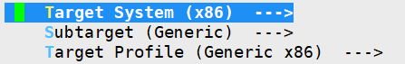
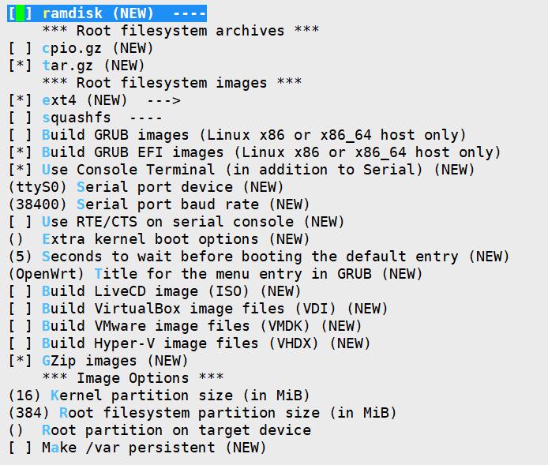
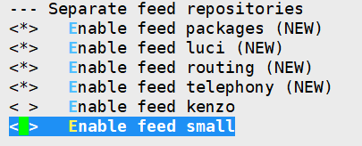

# 从官方仓库编译 OpenWRT

参考本教程能够从 **OpenWRT官方仓库** 和 **第三方软件仓库** 编译出一个简洁的 OpenWRT 系统。

简洁指，非必要，不编译。

### 1. 准备

- 推荐用 Debian 11 or Ubuntu 22.04
- 硬盘空间至少 60G
- 全局代理

- 全程使用使用非 root 用户

### 2. 编译前环境

1. 更新系统

   ```shell
   sudo apt update
   ```

   ```shell
   sudo apt upgrade
   ```

2. 安装依赖，参考 [OpenWRT官网构建指南](https://openwrt.org/docs/guide-developer/toolchain/install-buildsystem#debianubuntu)

   ```shell
   sudo apt install build-essential clang flex bison g++ gawk gcc-multilib gettext \
   git libncurses5-dev libssl-dev python3-distutils rsync unzip zlib1g-dev \
   file wget
   ```

3. 到 [openwrt github 官方仓库](https://github.com/openwrt/openwrt) 找到最新的稳定分支（截至 2023-02-28，最新稳定分支为 22.03），使用官方仓库稳定分支编译

   ```shell
   git clone https://github.com/openwrt/openwrt.git -b openwrt-22.03
   ```

4. 官方仓库的代码仅有基本的路由组件，如果你需要一些代理软件，需要增加第三方仓库，这里使用 [kenzok8/small](https://github.com/kenzok8/small) 仓库

   进入刚才下载的 openwrt 目录

   ```shell
   cd openwrt
   ```

   将第三方仓库地址加入到 openwrt/feeds.conf.default，并拉取

   ```shell
   sed -i '$a src-git kenzo https://github.com/kenzok8/openwrt-packages' feeds.conf.default
   sed -i '$a src-git small https://github.com/kenzok8/small' feeds.conf.default
   ./scripts/feeds update -a
   ./scripts/feeds install -a
   ```

5. 选择需要的软件包

   ```
   make menuconfig
   ```

   运行后会输出一个图形界面菜单

   1. 系统架构和芯片类型

      这个根据自己要在哪台机器上运行 OpenWRT 来选

   

   2. 镜像输出

      输出格式根据自己的需要来选，一般输出 GZip images，用来直接烧写和在线升级

      Kernel partition 是内核分区大小，默认 16 MB 没试过超的

      Root filesystem partition size 是根分区文件系统大小，如果你要预装很多软件，以后也需要一定空间，可以把这个改大

      

      

   3. 软件镜像

      去掉第三方的，因为这些库没有预编译好的软件给我们编译完成后的系统使用

      

      

      

      

   4. Base system

      系统基本软件，这里有几个要注意的，从上到下依次操作如下

      - [x] ca-certificates（系统 CA 证书，避免系统本身访问 https 出问题）
      - [ ] dnsmasq（DNS 和 DHCP 相关，选后面的 dnsmasq-full，**一定要取消选择这个**）
      - [x] dnsmasq-full
      - [ ] dropbear（ssh server，个人更习惯用 openssh-server）

   5. Administration

      - [x] htop（命令行下图形化监控系统状态）

   6. Development

      一些开发编译用的程序，如 gcc，make 等，如果需要可以选

   7. firmware

      一些芯片包括网卡芯片的固件，可以浏览一遍，如果有你自己需要用的网卡等芯片在里面，选上，否则保持默认

   8. Kernel module

      一些内核模块，包括文件系统、网卡、USB等等的驱动，如果需要选上，其他保持默认

      - [x] USB Support->kmod-usb-net-rtl8152

   9. Languages

      编程语言，需要自己选，**建议选 python->python3**，以后运行一些 python3 脚本方便很多

   10. Libraries

       一些库，自己有需求的单独选，否则保持默认

       - [x] libqrencode

   11. LuCI

       Web 图形化面板

       - [x] Collections->luci
       - [x] Collections->luci-ssl-openssl
       - [x] Modules->luci-mod-rpc

       LuCI->Applications 一些软件的面板都在这里，包括代理软件面板（如bypass，passwall2），根据自己需要选，一般选一个就够了，下面是个人喜好

       - [x] luci-app-acme（申请 https 证书）
       - [ ] 反选所有 ssr，用不上
       - [ ] 反选 ss-obfs，用不上
       - [ ] 代理程序（ss, xray, naiveproxy）只在 passwall 和 passwall2 中选
       - [x] luci-app-passwall2
       - [x] luci-app-wireguard（wireguard）

   12. Network

       网络相关应用，慢慢挑，以下是个人喜好

       - [x] NMAP Suite->ncat-full
       - [x] NMAP Suite->nmap-full
       - [x] SSH->openssh-client-utils（会自动选上几个）
       - [x] **SSH->openssh-server**（会自动选上 libfido2，之前去掉了dropbear，这里要选回来一个）
       - [x] SSH->openssh-sftp-client
       - [x] SSH->openssh-sftp-server
       - [x] Time-Synchronization->ntpclient
       - [x] VPN->zerotier
       - [x] Version Control Systems->git-http（会自动选 git）
       - [x] acme-dnsapi
       - [x] iperf3-ssl （测速）
       - [x] tcpdump（抓包）

   13. Utilities

       - [x] Editors->vim-full（默认用的是青春版）

       - [x] Shells->bash（默认用的是ash）

       - [x] Compression->bzip2

       - [x] Compression->gzip

       - [x] Compression->unzip

       - [x] Compression->xz-utils

   14. 保存

6. 下载所选软件

   -j 后面接线程数，根据自己机器选择

   ```shell
   make -j8 download V=s
   ```

7. 编译

   很多地方说第一次编译用单线程，但我一直用多线程没出事

   ```shell
   make -j8 V=s
   ```

   编译完成后，文件在 openwrt/bin/targets/ 对应架构的文件夹目录下

### 3. 二次编译

在 openwrt 目录下执行

1. 从官方源仓库更新

   ```shell
   git pull
   ```

2. 从第三方仓库更新

   ```shell
   ./scripts/feeds update -a
   ./scripts/feeds install -a
   ```

3. 清理旧的下载（可选，其实大部分都是能重复用的，半年清一次就行）

   ```shell
   rm -rf ./dl
   ```

4. 清理之前编译的中间文件（可选）

   ```shell
   make clean
   ```

5. 清理缓存

   ```shell
   rm -rf ./tmp
   ```

6. 重新选择软件（可选）

   ```shell
   make menuconfig
   ```

7. 下载和编译

   ```
   make -j8 download V=s
   make -j8 V=s
   ```
